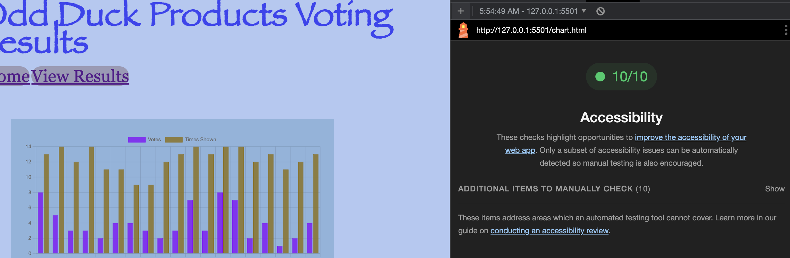

# LAB - Number 14

## Odd Duck

App where user votes on product images. Totals are stored and presented to the user.

### Author: Student/Group Name
Arthur Fansisco
DanQuinn

### Links and Resources

[chart.js](https://www.chartjs.org/)

### Lighthouse Accessibility Report Score

### Reflections and Comments

* Consider including the answers to your daily journal and submission questions here
* This is also a good place to reflect on the tools and resources used and learned